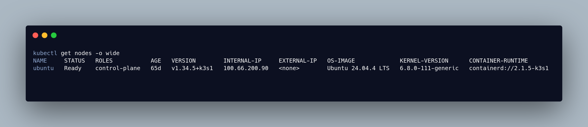
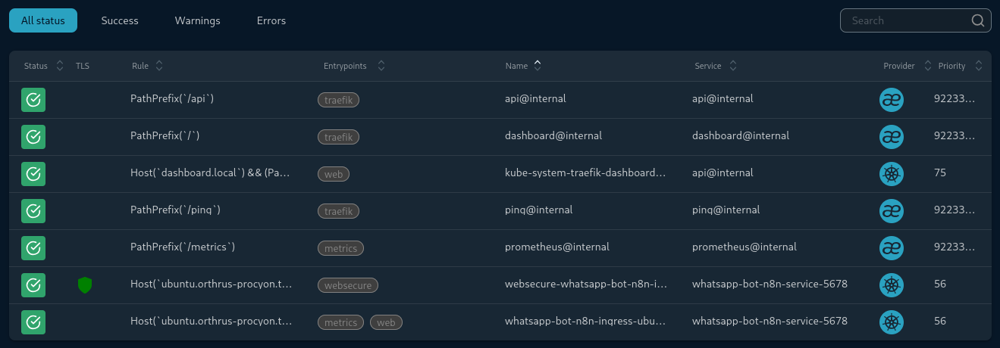

```Markdown
> 🔄 **Architecture Refactor Note (June 2026):** While this post documents the initial phase of manual K3s installation and base Traefik routing, I have since modularized this entire compute layer. The manual steps below have been completely automated using **OpenTofu** and are now bootstrapped seamlessly via the GitOps App-of-Apps pattern detailed in [Stage III](/blog/stage-3-perimeter-observability/).
```

Building Kubernetes in the cloud is easy—cloud providers abstract all the hard networking and compute layers away from you. To truly understand Cloud Native architecture, I decided to build a zero-trust environment from the ground up.

This post covers **Stage I** of my 10-Phase Engineering Roadmap: establishing the virtualized compute layer, deploying a zero-trust mesh VPN, bootstrapping the K3s cluster, and configuring edge routing.

## Table of Contents

1. [The Base Compute Environment & Zero-Trust Access](#base-compute)
2. [Declarative Infrastructure with OpenTofu](#opentofu)
3. [Bootstrapping Bare-Metal K3s](#k3s-setup)
4. [Edge Routing & Traefik Challenges](#traefik-ingress)
5. [Stage I Outcomes](#outcomes)

## 1. The Base Compute Environment & Zero-Trust Access {#base-compute}

To simulate a true enterprise environment, I am running a bare-metal **Kali Linux** host. However, I am not running the cluster directly on the host OS. Instead, I am using **KVM (Kernel-based Virtual Machine)** to spin up an isolated Ubuntu server guest. 

Furthermore, to enforce zero-trust from day one, SSH port 22 is completely blocked from the public internet. Access to the Ubuntu KVM is handled exclusively via **Tailscale**, creating an encrypted wireguard mesh tunnel that allows me to SSH into the root environment securely from anywhere.

To confirm the virtualized compute layer was running smoothly, here is the output verifying the KVM guest status on the Kali host:


## 2. Declarative Infrastructure with OpenTofu {#opentofu}

To eliminate manual configuration drift right from the start, I used **OpenTofu** with the `libvirt` provider to manage the underlying state of the Ubuntu virtual machine.

Here is a snippet of how I structured the infrastructure provisioning:

```hcl
terraform {
  required_providers {
    libvirt = {
      source = "dmacvicar/libvirt"
      version = "0.7.6"
    }
  }
}

provider "libvirt" {
  uri = "qemu:///system"
}

# Download the official Ubuntu Cloud Image
# 1. The Base Image (Downloads and stores the raw Ubuntu image)
resource "libvirt_volume" "ubuntu_base" {
  name   = "ubuntu-base.qcow2"
  pool   = "default"
  source = "${path.module}/noble-server-cloudimg-amd64.img"
  format = "qcow2"
}

# 2. The Actual VM Drive (Clones the base and stretches it to 30GB)
resource "libvirt_volume" "ubuntu_image" {
  name           = "ubuntu-24.04.qcow2"
  pool           = "default"
  base_volume_id = libvirt_volume.ubuntu_base.id
  size           = 32212254720 # 30GB - SSD
  format         = "qcow2"
}

# Inject the cloud-init file (which now contains Tailscale)
resource "libvirt_cloudinit_disk" "commoninit" {
  name      = "commoninit.iso"
  user_data = file("${path.module}/cloud_init.cfg")
  pool      = "default"
}

# Define the Virtual Machine
resource "libvirt_domain" "k3s_node" {
  name   = "k3s-server"
  memory = "6144" # 6GB RAM
  vcpu   = 2      # 2 CPU Cores

  cloudinit = libvirt_cloudinit_disk.commoninit.id

  network_interface {
    network_name   = "default"
    wait_for_lease = true
  }

  disk {
    volume_id = libvirt_volume.ubuntu_image.id
  }

  console {
    type        = "pty"
    target_port = "0"
    target_type = "serial"
  }
}
```

**The Challenge:** The most frustrating part of this setup was dealing with libvirt socket permissions. By default, the OpenTofu provider running on the Kali host was getting `permission denied` when trying to connect to the `qemu:///system` socket. I had to properly configure the `libvirt` group policies and Polkit rules on the host to allow the declarative pipeline to automatically provision the VM without requiring interactive root prompts.

## 3. Bootstrapping Bare-Metal K3s {#k3s-setup}

For container orchestration, I chose **K3s**. It is lightweight enough to run highly efficiently on the Ubuntu guest, but fully conformant for enterprise-grade deployments.

To install and bootstrap the cluster securely, I explicitly passed arguments to bind to my Tailscale interface and disabled the default local storage path to maintain strict control:

```bash
curl -sfL [https://get.k3s.io](https://get.k3s.io) | INSTALL_K3S_EXEC="--node-ip <TAILSCALE_IP_ADDRESS> --bind-address <TAILSCALE_IP_ADDRESS> --tls-san <TAILSCALE_IP_ADDRESS>" sh -
```

Once the script executed, the node successfully registered itself using the secure Tailscale interface, as shown in the cluster node status:



## 4. Edge Routing & Traefik Challenges {#traefik-ingress}

Networking on local KVM Kubernetes is drastically different than the cloud. You don't have AWS or GCP to automatically provision an Elastic Load Balancer (ELB) for you. 

I utilized **Traefik** as the primary Ingress Controller, deploying it via Helm to manage routing for my internal services.

```yaml
apiVersion: networking.k8s.io/v1
kind: Ingress
metadata:
  name: n8n-ingress
  namespace: whatsapp-bot   
spec:
  ingressClassName: traefik
  rules:
  - host: <Magic-DNS-FROM-TAILSCALE>  # MagicDNS name
    http:
      paths:
      - path: /
        pathType: Prefix
        backend:
          service:
            name: n8n-service  # n8n service
            port:
              number: 5678     # 5678 default n8n port
```

**The Fix:** Originally, exposing services from an isolated KVM guest required complex iptables rules, sysctl IP forwarding, and dealing with port 80/443 conflicts on the Kali host. To completely bypass this networking headache, I utilized Tailscale MagicDNS. By binding K3s and Traefik directly to the Tailscale interface inside the VM, I created a secure overlay network. Now, Traefik routes traffic seamlessly via MagicDNS, completely bypassing the Kali host's physical network bridge and eliminating the need for complex port-forwarding.

With the local DNS override in place and Traefik configured, I could securely access the internal dashboard. Here is the active HTTP routing rule proving the configuration works:



## 5. Stage I Outcomes {#outcomes}

By the end of Phase 4, the foundation was set:
* **Infrastructure is codified:** The Ubuntu VM environment can be reliably rebuilt using OpenTofu.
* **Orchestration is live:** K3s is running natively and efficiently.
* **Access is secured:** The host and guest are protected behind a Tailscale zero-trust perimeter.

With the base compute and networking established, the cluster was ready for application workloads. 

**Next up:** In [Stage II](/blog/stage-2-automation-zero-trust/), I dive into how I layered **GitHub Actions** and **ArgoCD** on top of this foundation to enforce GitOps compliance, and how I secured the cluster credentials using **HashiCorp Vault**.