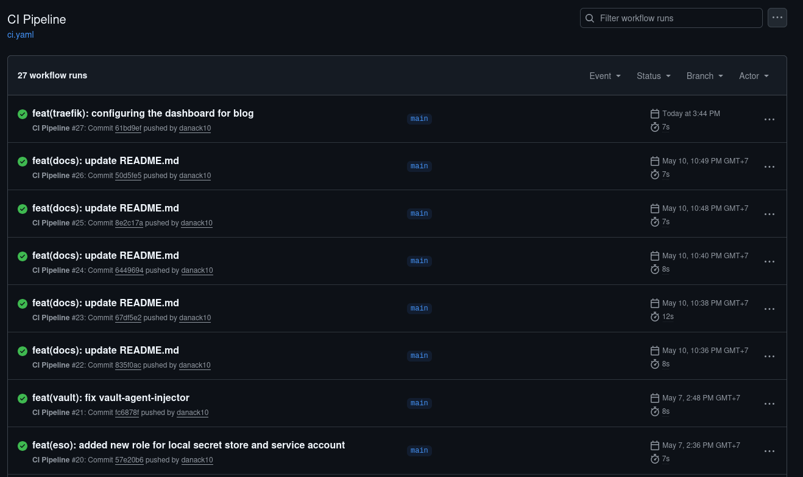
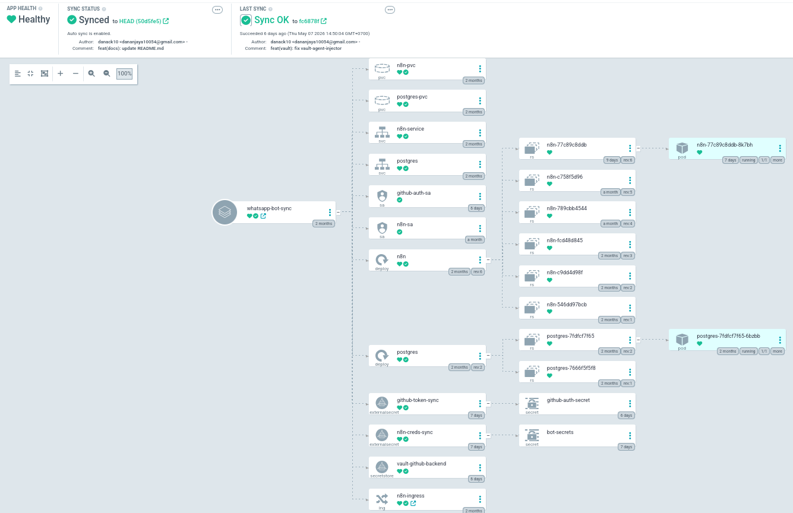
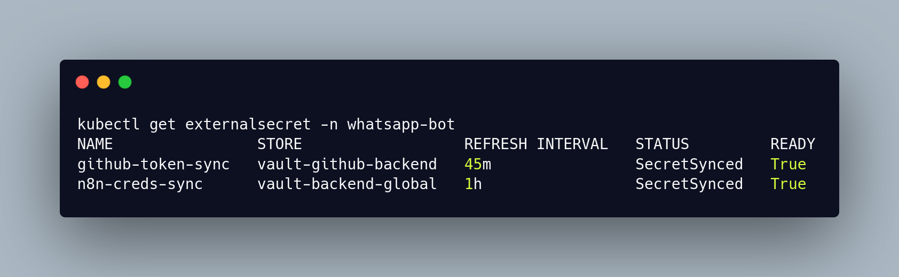

---

title: "Stage II: CI/CD Pipeline, GitOps & Ephemeral Secrets"
date: 2026-05-16
summary: "A deep dive into Phases 5-6: Building Docker images via GitHub Actions, eliminating configuration drift with ArgoCD, and injecting zero-trust credentials using HashiCorp Vault and ESO."
tags:
  - GitOps
  - ArgoCD
  - HashiCorp Vault
  - GitHub Actions
  - DevSecOps
authors:
  - me
featured: true
share: false
---

With a highly available K3s foundation established on my KVM environment in Stage I, the cluster was functional but not yet "enterprise-grade." Manually applying manifests leads to configuration drift, and standard Kubernetes Secrets violate zero-trust security principles. 

This post covers **Stage II** of the roadmap: establishing a strict CI/CD GitOps pipeline and securing the cluster's sensitive credentials for my stateful workloads (specifically my n8n workflow engine and PostgreSQL database).

## Table of Contents

1. [Continuous Integration with GitHub Actions](#github-actions)
2. [The GitOps Philosophy: ArgoCD & Helm](#argocd)
3. [The Problem with K8s Secrets](#secrets-problem)
4. [Declarative Security with Vault & OpenTofu](#vault)
5. [Bridging the Gap: External Secrets Operator (ESO)](#eso)
6. [Stage II Outcomes](#outcomes)

## 1. Continuous Integration with GitHub Actions {#github-actions}

Before deployment can happen, the code must be built into an immutable artifact. I utilized **GitHub Actions** to automatically build my application code into Docker images and push them to the container registry on every main branch commit. This ensures that if a deployment breaks, I can instantly roll back to a previously tagged, working image.

Here is a view of the automated pipeline successfully building and pushing the containerized application upon a new commit:



## 2. The GitOps Philosophy: ArgoCD & Helm {#argocd}

The core rule of GitOps is simple: **The Git repository is the single source of truth.** I deployed **ArgoCD** to operate as a continuous reconciliation loop, tracking my GitHub repository. Rather than syncing raw YAML, ArgoCD dynamically renders my deployments using **Helm** and **Kustomize** before applying them to the K3s cluster.

```yaml
apiVersion: argoproj.io/v1alpha1
kind: Application
metadata:
  name: whatsapp-bot-sync
  namespace: argocd
spec:
  project: default
  source:
    repoURL: '[https://github.com/danack10/k3s-whatsapp-chatbot.git](https://github.com/danack10/k3s-whatsapp-chatbot.git)'
    targetRevision: HEAD
    path: apps/whatsapp-bot/base
  destination:
    server: '[https://kubernetes.default.svc](https://kubernetes.default.svc)'
    namespace: whatsapp-bot
  syncPolicy:
    automated:
      prune: true
      selfHeal: true
    syncOptions:
      - CreateNamespace=True
```

Once applied, the GitOps synchronization kicks in. The following dashboard view shows ArgoCD mapping and deploying the entire application stack:



**The Challenge:** Setting up secure authentication for ArgoCD to pull from my private repository was tricky. I wanted to use a dynamic GitHub App rather than a static Personal Access Token (PAT). Ensuring the GitHub App had the correct permissions scoped strictly to the `k3s-whatsapp-chatbot` repo took some trial and error. Additionally, before my edge ingress was fully established, I had to utilize `kubectl port-forward` routed entirely through my Tailscale mesh to access the ArgoCD UI, keeping the interface completely hidden from the public internet.

## 3. The Problem with K8s Secrets {#secrets-problem}

Deploying standard applications via GitOps is straightforward, but deploying secrets presents a major security flaw. You cannot push raw or base64-encoded secrets into a Git repository. 

To solve this, I deployed **HashiCorp Vault** as the centralized, encrypted credential store inside the cluster.

## 4. Declarative Security with Vault & OpenTofu {#vault}

Many engineers deploy Vault and then manually configure it using CLI commands (`vault write auth/kubernetes...`). To maintain my declarative infrastructure standards, I bypassed the CLI entirely and used the **OpenTofu Vault Provider** to configure Vault's state as code. This allowed me to declaratively define my Kubernetes authentication roles, policies, and secret engines.

**The Challenge:** Learning to manage persistent state in Kubernetes was a huge learning curve. Stateful workloads like Vault, n8n, and PostgreSQL require robust Persistent Volume Claims (PVCs). At one point, my `vault-0` pod entered a failure state. The "junior developer" instinct is to simply delete the PVC, tear the Vault down, and rebuild it from scratch. However, in an enterprise environment with thousands of production secrets, deleting the database is catastrophic! Instead of wiping it, I architected a proper recovery process: safely restarting the pod, maintaining the PVC integrity, and gracefully unsealing the vault using my Shamir key shares.

## 5. Bridging the Gap: External Secrets Operator (ESO) {#eso}

While Vault securely stores the credentials, my stateful workloads (n8n and Postgres) still need a way to read them without hardcoding Vault API logic into the application containers.

I implemented the **External Secrets Operator (ESO)** to act as an automated courier. It authenticates with Vault, reads the secure payload, and dynamically injects it into a standard native Kubernetes Secret.

```yaml
--
# 1. Pulling the static n8n database credentials
apiVersion: external-secrets.io/v1beta1
kind: ExternalSecret
metadata:
  name: n8n-creds-sync
  namespace: whatsapp-bot
spec:
  refreshInterval: "1h"
  secretStoreRef:
    name: vault-backend-global
    kind: ClusterSecretStore
  target:
    name: bot-secrets 
  data:
    - secretKey: DB_POSTGRESDB_USER
      remoteRef:
        key: n8n/config
        property: POSTGRES_USER

    - secretKey: DB_POSTGRESDB_PASSWORD
      remoteRef:
        key: n8n/config
        property: POSTGRES_PASSWORD

    - secretKey: N8N_ENCRYPTION_KEY
      remoteRef:
        key: n8n/config
        property: ENCRYPTION_KEY

---
# 2. Pulling the dynamic GitHub Token
apiVersion: external-secrets.io/v1beta1
kind: ExternalSecret
metadata:
  name: github-token-sync
  namespace: whatsapp-bot
spec:
  refreshInterval: "45m" 
  secretStoreRef:
    name: vault-github-backend
    kind: SecretStore
  target:
    name: github-auth-secret
  data:
    - secretKey: GITHUB_TOKEN
      remoteRef:
        key: github-app/token/whatsapp-bot 
        property: token
```

Because this `ExternalSecret` manifest contains no actual passwords (only reference pointers to Vault), it is perfectly safe to commit to GitHub and deploy via ArgoCD. The n8n and Postgres pods then consume `pg-secret-live` natively.

Here is the verification from the cluster showing the ExternalSecret successfully synchronized with Vault, proving the ephemeral credential pipeline is fully functional:



## 6. Stage II Outcomes {#outcomes}

By the end of Phase 6, the cluster achieved a true DevSecOps deployment pipeline:
* **Zero Manual Intervention:** Code pushed to Git is built by Actions, and automatically synchronized by ArgoCD.
* **Persistent & Stateful:** n8n, PostgreSQL, and Vault are securely backed by PVCs.
* **Zero-Trust Credentials:** No sensitive data exists in the repository. Configuration is handled declaratively via OpenTofu, and credentials are injected ephemerally by Vault and ESO.

With the deployment engine automated and secured, the cluster is ready to be exposed to the internet. 

**Next up:** In [Stage III](/blog/stage-3-perimeter-observability/), I cover how I secured the edge perimeter using **Cloudflare Tunnels** and established full-stack observability with **Prometheus and Grafana**.