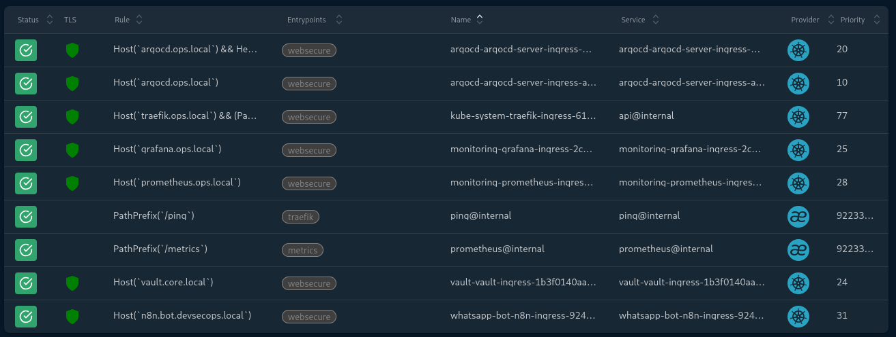
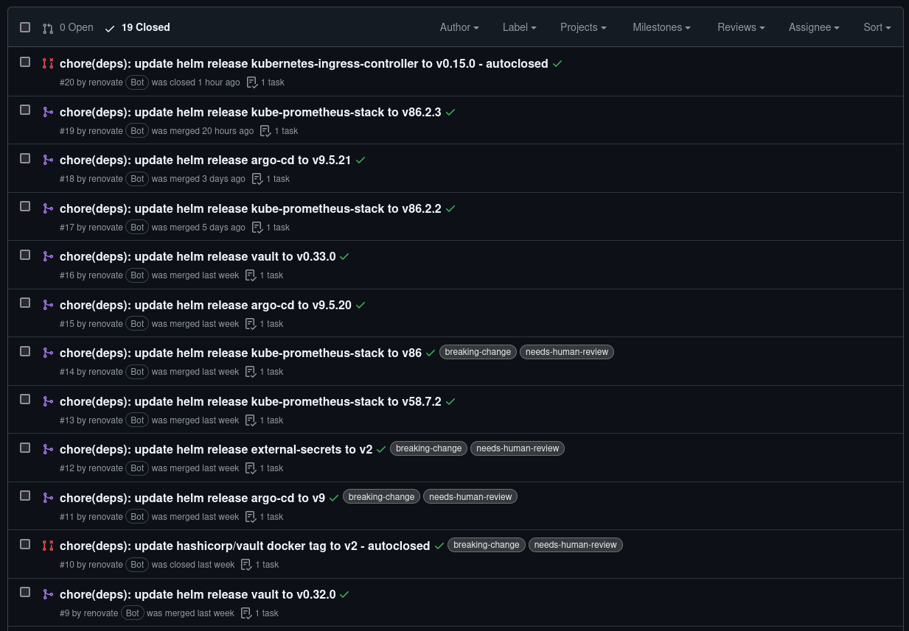
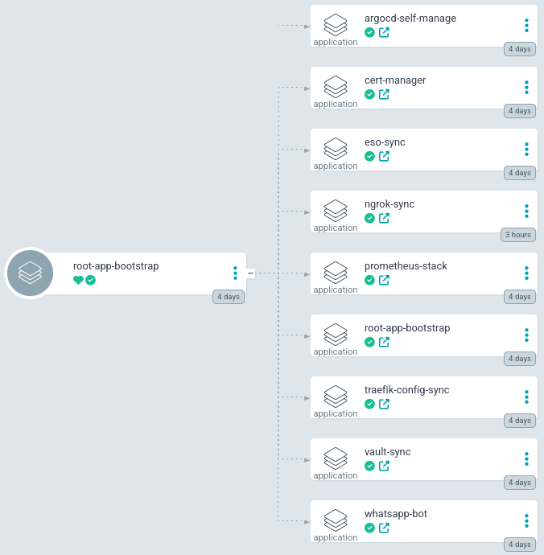

With my internal pipelines and zero-trust credential layers running in Stage II, the K3s cluster was functional but relied on fragmented application management. To transition this infrastructure into a true enterprise environment, I needed to automate cluster initialization and safely expose my core services to the outside world.

This post covers Stage III of the roadmap: orchestrating cluster components via the App-of-Apps pattern, routing traffic securely with Traefik, centralizing cryptographic lifecycles with a standalone Cert-Manager, and automating dependencies with Renovate Bot.

## Table of Contents

1. [Cluster Bootstrapping: The App-of-Apps Paradigm](#bootstrap)
2. [Edge Routing: Traefik Ingress Controller](#traefik)
3. [Centralized TLS Distribution: Cert-Manager](#cert-manager)
4. [The Telemetry Layer: Prometheus & Grafana](#observability)
5. [Self-Healing Dependencies: Renovate Bot Workflow](#renovate)
6. [Stage III Outcomes](#outcomes)

---

## 1. Cluster Bootstrapping: The App-of-Apps Paradigm {#bootstrap}

As my cluster grew, managing individual Helm charts and manifests manually introduced configuration drift and operational overhead. To achieve true declarative automation, I refactored the architecture to utilize the App-of-Apps pattern for cluster bootstrapping.

Under this model, I feed ArgoCD a single "Root Application." This root manifest points to a bootstrap directory in my repository containing nothing but other Application custom resources. When ArgoCD syncs the root, it automatically triggers a cascading deployment of the entire platform stack (the ingress layer, secret operators, monitoring engines, and the core chatbot framework) in a single operation.

My `root-app.yaml` manifest defines an Application resource named `cluster-bootstrap` inside the `argocd` namespace. It points to my repository source directory `https://github.com/danack10/k3s-whatsapp-chatbot` and targets the local destination cluster `https://kubernetes.default.svc`. An automated sync policy is enforced with both `prune: true` and `selfHeal: true` enabled to ensure that any manual mutations inside the cluster are automatically overwritten by the state I declared in Git.

---

## 2. Edge Routing: Traefik Ingress Controller {#traefik}

I customized Traefik to act as the cluster's edge reverse proxy. Instead of a monolithic routing file, I utilized decoupled Ingress definitions for each service, isolating our core infrastructure tools from the public application layers.

Below is the routing validation directly from the cluster, showing the active Traefik gateway parsing the entry points for the management layer:

> **Infrastructure Architecture Note:** To enforce a strict zero-trust posture, all administrative and platform dashboards (ArgoCD, Vault, and Grafana) remain strictly bound to my internal local network and are completely invisible to the public internet. The only endpoint explicitly exposed via a secure external edge is the primary **n8n webhook receiver**. This public traffic is safely routed into the cluster using an ephemeral **Ngrok edge tunnel**, isolating the core platform controllers from external scanning or brute-force vectors while maintaining public webhook availability.

```yaml
---
# 1. traefik-ingress.yaml
apiVersion: traefik.io/v1alpha1
kind: IngressRoute
metadata:
  name: traefik-ingress
  namespace: kube-system
spec:
  entryPoints:
    - websecure
  routes:
    - match: Host(`traefik.ops.local`) && (PathPrefix(`/api`) || PathPrefix(`/dashboard`))
      kind: Rule
      services:
        - name: api@internal
          kind: TraefikService
  tls:
    secretName: traefik-tls
```



---

## 3. Centralized TLS Distribution: Cert-Manager {#cert-manager}

Rather than relying on default, built-in webhook behaviors, I deployed and configured a standalone Cert-Manager instance. This architecture centralizes x509 certificate lifecycle management, operating as my internal Certificate Authority that binds directly to Vault through External Secrets Operator.

**Dynamic Refresh Logic:** To support a rapid development cycle where subdomains are constantly added, updated, or destroyed, Cert-Manager dynamically monitors the cluster control plane. The moment an Ingress manifest is introduced or edited by the bootstrap engine, Cert-Manager instantly processes the ACME challenge and provisions the corresponding TLS secret, preventing certificate expiration or rate-limiting blockades during frequent overrides.

---

## 4. The Telemetry Layer: Prometheus & Grafana {#observability}

To track performance metrics and catch security anomalies early, I deployed the kube-prometheus-stack. I isolated the routes into a single multi-document manifest file to keep the administrative visibility perimeter clean.

* **Prometheus Ingress:** Configured with an annotation mapping to my `vault-issuer` cluster issuer. It matches host rules for the Prometheus telemetry engine and routes traffic to backend port 9090.
* **Grafana Ingress:** Deployed in the same manifest file, capturing traffic destined for our Grafana visualization dashboard and routing it cleanly to service port 80.

The following dashboard view confirms the distinct routing parameters for the telemetry stack:

> **Infrastructure Architecture Note:** To enforce a strict zero-trust posture, all administrative and platform dashboards (ArgoCD, Vault, and Grafana) remain strictly bound to my internal local network and are completely invisible to the public internet. The only endpoint explicitly exposed via a secure external edge is the primary **n8n webhook receiver**. This public traffic is safely routed into the cluster using an ephemeral **Ngrok edge tunnel**, isolating the core platform controllers from external scanning or brute-force vectors while maintaining public webhook availability.

```yaml
---
# 2. prometheus-ingress.yaml
apiVersion: traefik.io/v1alpha1
kind: IngressRoute
metadata:
  name: prometheus-ingress
  namespace: monitoring
spec:
  entryPoints:
    - websecure
  routes:
    - match: Host(`prometheus.ops.local`)
      kind: Rule
      services:
        - name: prometheus-stack-kube-prom-prometheus
          port: 9090
  tls:
    secretName: prometheus-tls
```

```yaml
---
# 3. grafana-ingress.yaml
apiVersion: traefik.io/v1alpha1
kind: IngressRoute
metadata:
  name: grafana-ingress
  namespace: monitoring
spec:
  entryPoints:
    - websecure
  routes:
    - match: Host(`grafana.ops.local`)
      kind: Rule
      services:
        - name: prometheus-stack-grafana
          port: 80
  tls:
    secretName: grafana-tls
```

### Core Workload Access (n8n, Vault, ArgoCD)
To finalize the edge, I mapped the remaining application and security perimeters. This allows secure external access to the n8n automation engine webhooks, alongside my administration dashboards.

> **Infrastructure Architecture Note:** To enforce a strict zero-trust posture, all administrative and platform dashboards (ArgoCD, Vault, and Grafana) remain strictly bound to my internal local network and are completely invisible to the public internet. The only endpoint explicitly exposed via a secure external edge is the primary **n8n webhook receiver**. This public traffic is safely routed into the cluster using an ephemeral **Ngrok edge tunnel**, isolating the core platform controllers from external scanning or brute-force vectors while maintaining public webhook availability.

```yaml
---
# 4. n8n-ingress.yaml
apiVersion: traefik.io/v1alpha1
kind: IngressRoute
metadata:
  name: n8n-ingress
  namespace: whatsapp-bot
spec:
  entryPoints:
    - websecure
  routes:
    - match: Host(`n8n.bot.devsecops.local`)
      kind: Rule
      services:
        - name: n8n-service
          port: 5678
  tls:
    secretName: n8n-tls
```

```yaml
---
# 5. vault-ingress.yaml
apiVersion: traefik.io/v1alpha1
kind: IngressRoute
metadata:
  name: vault-ingress
  namespace: vault
spec:
  entryPoints:
    - websecure
  routes:
    - match: Host(`vault.core.local`)
      kind: Rule
      services:
        - name: vault-ui
          port: 8200
  tls:
    secretName: vault-tls
```

```yaml
---
# 6. argocd-ingress.yaml
apiVersion: traefik.io/v1alpha1
kind: IngressRoute
metadata:
  name: argocd-server-ingress
  namespace: argocd
spec:
  entryPoints:
    - websecure
  routes:
    - match: Host(`argocd.ops.local`)
      kind: Rule
      priority: 10
      services:
        - name: argocd-server
          port: 80
    - match: Host(`argocd.ops.local`) && Header(`Content-Type`, `application/grpc`)
      kind: Rule
      priority: 20
      services:
        - name: argocd-server
          port: 80
          scheme: h2c
  tls:
    secretName: argocd-tls
```

---

## 5. Self-Healing Dependencies: Renovate Bot Workflow {#renovate}

To protect the infrastructure supply chain from outdated code and vulnerabilities (CVEs), I implemented Renovate Bot to execute automated package updates. 

I enforced a tiered automated policy tailored for enterprise stability:
* **Minor & Patch Upgrades:** Renovate automatically opens an isolated Feature Branch Pull Request. If my automated CI tests pass successfully, the pipeline triggers an auto-merge straight into the main branch, allowing ArgoCD to reconcile the change with zero manual intervention.
* **Major Upgrades:** These require manual engineering confirmation. Renovate creates a comprehensive PR containing the upstream changelog and breaking changes, waiting for manual approval before mutating production manifests.



---

## 6. Stage III Outcomes {#outcomes}

The infrastructure now operates as a hardened, entirely self-bootstrapping ecosystem:
* **Atomic Cluster Scaling:** A new K3s node can be completely provisioned and loaded with our entire stack simply by applying the single Root Application.
* **Cryptographic Agility:** The standalone Cert-Manager automatically secures newly declared subdomains on the fly.
* **Continuous Security Lifecycle:** Minor version dependencies heal and update themselves through automated Renovate PRs.

The final ingress blueprints verify the secure public-facing management dashboards, concluding the Stage III framework:



**Next up:** In [Stage IV](/blog/stage-4-hardening-recovery/), I cover how I introduce strict **Shift-Left security scanning** into my CI pipeline, implement enterprise disaster recovery using **Velero**, and configure **Prometheus Alertmanager** to establish an automated incident detection and response ecosystem.